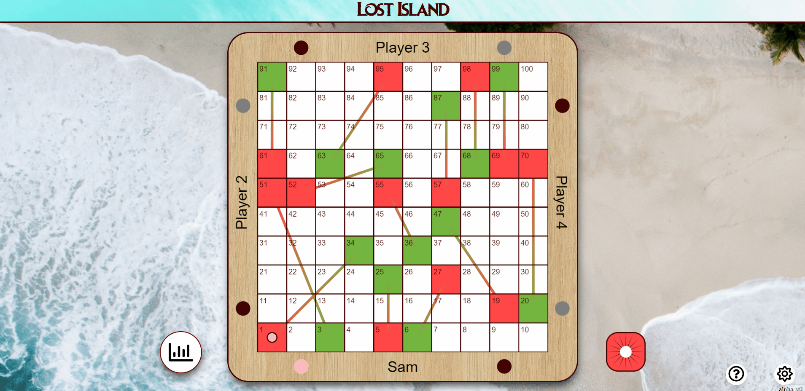

# Archipelagos

## What?

A tasks to make a single page application (SPA) with react library. The complexity should be enough to last 2 weeks

## Why?

To test my frontend abilities before doing actual frontend production works given a deadline

## How?

1. Setup project management
2. Draft and propose possible designs
3. Setup application
4. Implement application
5. Refined and adjust scoping of the application
6. Deploy and showcase application

## The Story

Your teams stranded in an unknown archipelagos fill with venomous giant snakes.Your task is to hop into other island by reaching the mysterious portal of each island,what mysterious lies ahead? You are only given ladder at certain area to help hasten your journey. Good Luck!

## Features

1. Single-player
2. Leaderboard score
3. Informative guidelines

## Highlights

## Deployment Sites

[click here](https://archipelagos.netlify.app/)

## Note

1. Not all features are implemented due to underestimated time
2. The current state of the application was still in the refactoring process. Thus, some intended function is not working properly.
3. Not all function are tested. Thus, potential bugs may exist.

## Disclaimer

All external data and assets in this project used is intended for educational purpose only.

## Contributor

Archipelagos Team
